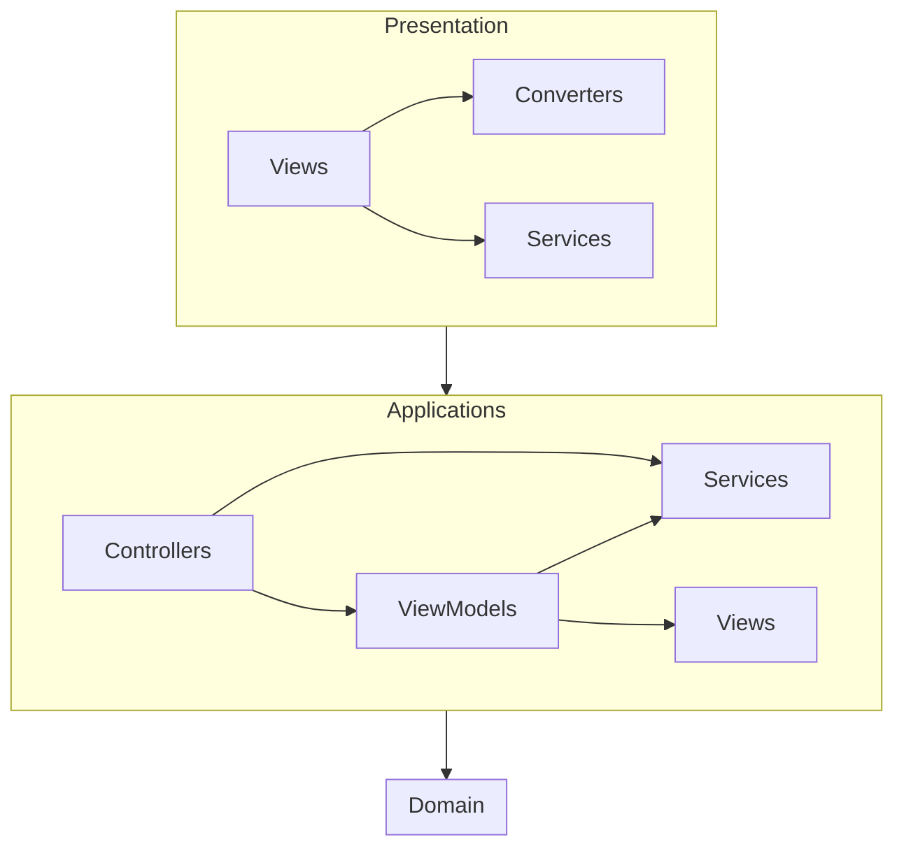

# Architecture

## Namespace (Layer) diagram

```mermaid
flowchart TB

  subgraph P["Presentation"]
    direction LR
    P_C["Converters"]
    P_S["Services"]
    P_V["Views"]
  end

  subgraph A["Applications"]
    direction LR
    A_C["Controllers"]
    A_S["Services"]
    A_VM["ViewModels"]
    A_V["Views"]
  end

  subgraph D["Domain"]
    direction LR
  end

  P --> A
  A --> D

  P_V --> P_C
  P_V --> P_S

  A_C --> A_S
  A_C --> A_VM
  A_VM --> A_S
  A_VM --> A_V
```